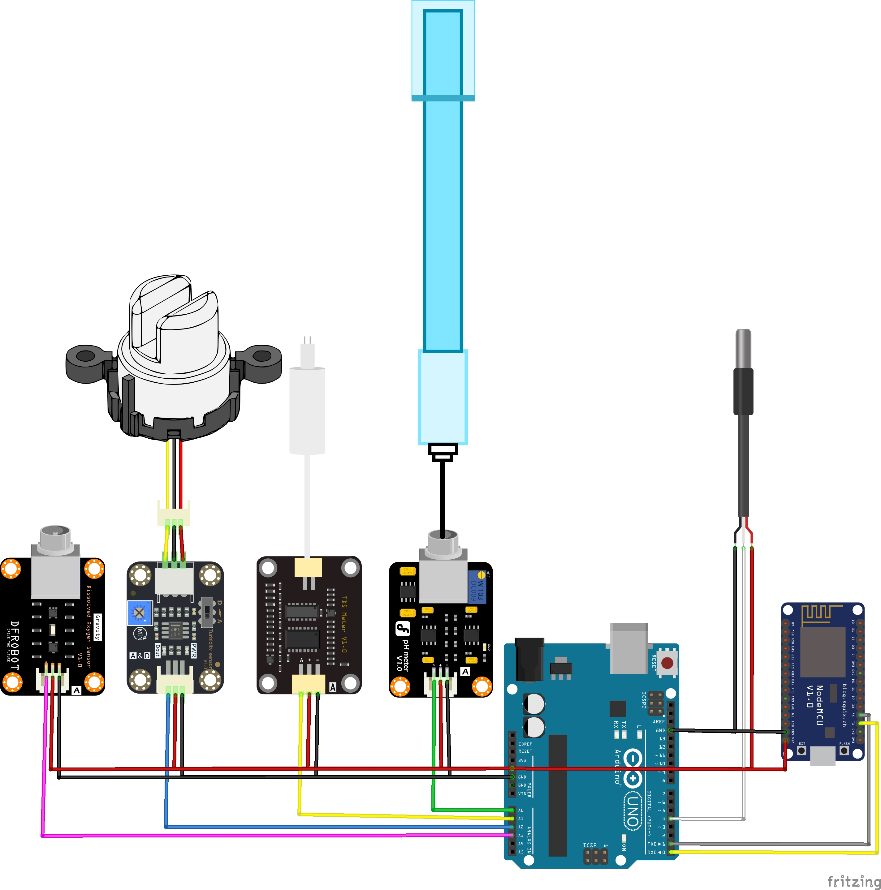

# 💧 Smart Water Quality Monitoring System (IoT)

 

*Note: This project was developed as part of an educational mentoring program for hardware engineering students.*

---

## 🇬🇧 English Version

A comprehensive IoT system designed to monitor real-time water quality across 5 critical parameters. The system utilizes a dual-microcontroller architecture: an Arduino Uno acts as the dedicated sensor data acquisition node, which processes analog signals and transmits them via UART to an ESP8266. The ESP8266 hosts a dynamic local Web Dashboard to visualize the data.

### 🚀 Key Technical Features
* **Dual-MCU Architecture:** Seamless UART serial communication between Arduino Uno (Sensor Node) and NodeMCU ESP8266 (WiFi/Web Node).
* **Multi-Parameter Sensing:** Real-time tracking of **pH, TDS (Total Dissolved Solids), Turbidity, DO (Dissolved Oxygen)**, and **Temperature** (DS18B20).
* **Advanced Signal Processing:** * Implements **Median Filtering** and **Moving Average** algorithms to eliminate ADC noise and stabilize analog readings.
  * Real-time **Temperature Compensation** applied to both TDS and Dissolved Oxygen algorithms for industrial-grade accuracy.
* **Dynamic Web Dashboard:** Hosts a sleek, responsive UI using Google Charts (`gauge` visualization). Automatically updates every second and alerts users to abnormal levels via color-coded indicators.
* **Captive Portal WiFi Config:** Features an embedded DNS server and EEPROM storage to seamlessly configure local WiFi credentials without hardcoding or re-flashing.

### 🛠️ Hardware Diagram

*(Note: Visualizes the intricate analog routing and UART connection between the microcontrollers).*

---

## 🇻🇳 Bản Tiếng Việt

Hệ thống IoT giám sát chất lượng nước toàn diện theo thời gian thực. Dự án ứng dụng kiến trúc vi điều khiển kép: Arduino Uno đóng vai trò Node thu thập và xử lý tín hiệu cảm biến, sau đó truyền dữ liệu qua giao thức UART sang ESP8266. ESP8266 chịu trách nhiệm duy trì kết nối mạng và khởi chạy một Web Server nội bộ trực quan.

### 🚀 Tính năng kỹ thuật nổi bật
* **Kiến trúc MCU Kép:** Giao tiếp nối tiếp (UART) đồng bộ giữa Arduino và ESP8266, tích hợp cơ chế kiểm tra trạng thái mất kết nối (UART timeout alert).
* **Đa cảm biến:** Đo lường đồng thời 5 chỉ số: **pH, TDS, Độ đục (Turbidity), Nồng độ Oxy hòa tan (DO)** và **Nhiệt độ** (DS18B20).
* **Xử lý Tín hiệu Số (DSP):** * Áp dụng thuật toán **Lọc trung vị (Median Filter)** và **Trung bình động (Moving Average)** để loại bỏ nhiễu tín hiệu ADC từ môi trường nước.
  * Tích hợp thuật toán **Bù nhiệt độ (Temperature Compensation)** vào phương trình tính toán TDS và DO, đảm bảo độ chính xác cao.
* **Web Dashboard Trực quan:** Giao diện điều khiển sử dụng Google Charts (Gauge), tự động cập nhật dữ liệu mỗi giây bằng Fetch API. Hiển thị cảnh báo trực quan (Xanh/Vàng/Đỏ) khi chỉ số vượt ngưỡng an toàn.
* **Cấu hình WiFi Thông minh (Captive Portal):** Tự động phát WiFi nội bộ để người dùng nhập mật khẩu mạng nhà. Lưu trữ cấu hình an toàn vào EEPROM của ESP8266.

### ⚙️ Hướng dẫn nạp code (Flashing Guide)
1. **Sensor Node:** Mở `Sensor_Node_Arduino/arduino_4cambien.ino`, nạp vào bo mạch Arduino Uno. (Yêu cầu thư viện: `OneWire`, `DallasTemperature`).
2. **Web Node:** Mở `Web_Server_ESP8266/esp01_4cambien.ino`. Chỉnh sửa lại các thông số IP Tĩnh (Static IP) nếu cần thiết cho phù hợp với Router của bạn, sau đó nạp vào ESP8266.
